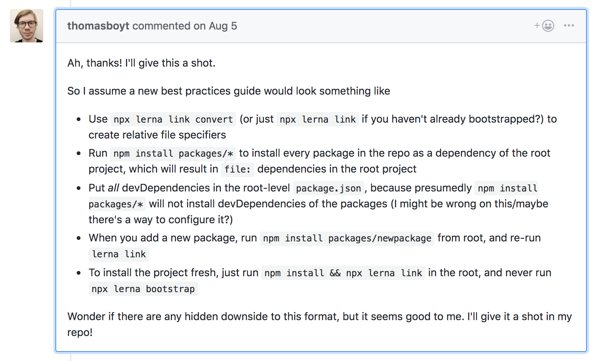

# Hello, world

This is a reduced test case to reproduce an issue we're facing.

## The Setup

Our product is using [lerna](https://github.com/lerna/lerna) to manage a mono repo. We've followed [a comment on an issue](https://github.com/lerna/lerna/issues/1462#issuecomment-410536290) in an attempt to get `package-lock.json` file support.



We're using:

- `lerna@3.4.3`
- `node@8.11.1`
- `npm@5.6.0`

## The Issue

After moving dev dependencies up to the root level, packages no longer have access `<package root>/node_modules/.bin` executables. So, if we wanted to run [eslint](https://eslint.org/) in a package, we would need to explicitly call the executable path. E.g.:

```json
{
  "scripts": {
    "lint": "eslint",
    "lint:hack": "./../../node_modules/.bin/eslint"
  }
}
```

However, we're still able to import packages installed in higher level `node_modules` in our `.js` files.

I've reproduced this result with an example package. Run `npm run setup` in order to generate `node_modules` with the example package.

To test, at the root repo level run `npm run yellow` then `cd packages/example && npm run yellow`. As I understand it, both should have called the same executable. However, inside a `packages/example`, it causes an error:

```bash
$ npm run yellow

> monorepo-issue-reduced-test-case@ yellow /Users/monorepo-issue-reduced-test-case/packages/example
> yellow

sh: yellow: command not found
npm ERR! file sh
npm ERR! code ELIFECYCLE
npm ERR! errno ENOENT
npm ERR! syscall spawn
npm ERR! monorepo-issue-reduced-test-case@ yellow: `yellow`
npm ERR! spawn ENOENT
npm ERR!
npm ERR! Failed at the monorepo-issue-reduced-test-case@ yellow script.
npm ERR! This is probably not a problem with npm. There is likely additional logging output above.
npm WARN Local package.json exists, but node_modules missing, did you mean to install?

npm ERR! A complete log of this run can be found in:
npm ERR!     /Users/.npm/_logs/2019-01-31T18_12_26_737Z-debug.log
```

## The Hack

Our current working solution is to add the `.bin` directory to our `$PATH`. It works, but it seems like incorrect behavior.

## The Summary

Is this an issue with how npm resolves `.bin` executables, or is my understanding incorrect? How can we get this working?
